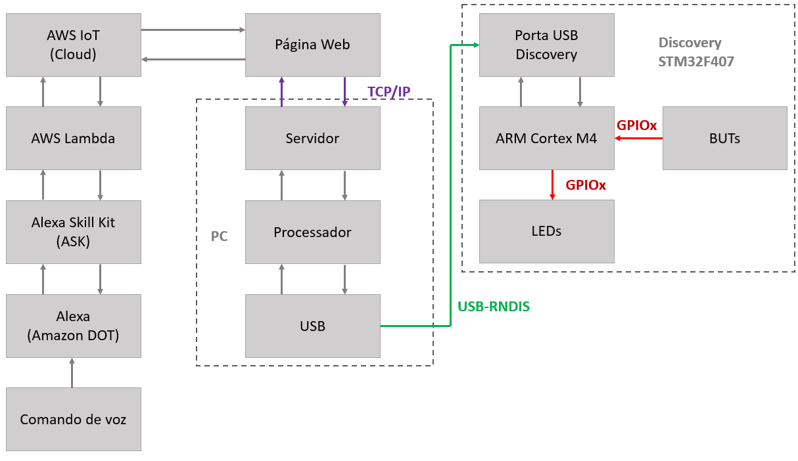
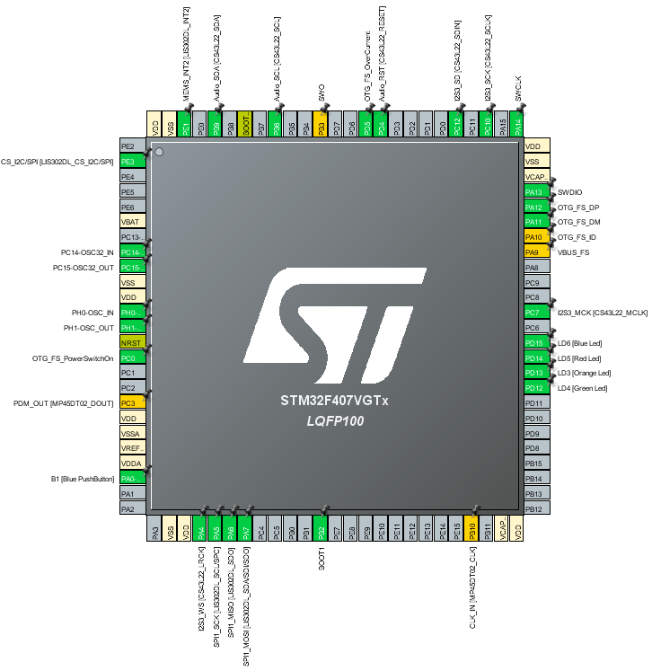
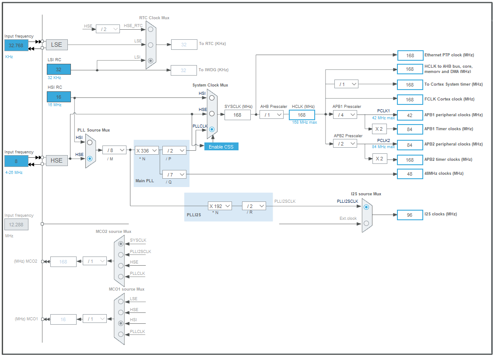
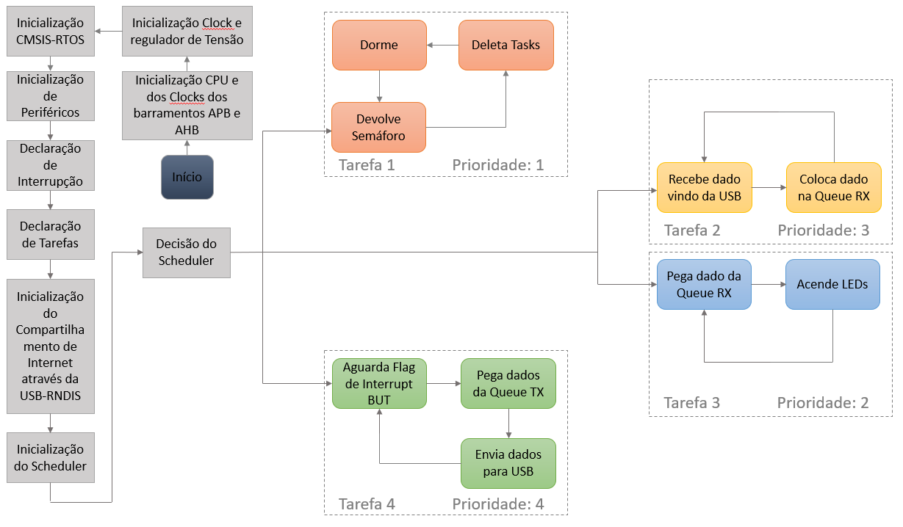

# Gabriel_IoT_FreeRTOS
Aplicação em Internet das coisas utilizando FreeRTOS no ARM Cortex M4

# Descrição do Projeto:

  No contexto atual, com os ciclos de tecnologia se renovando cada vez mais rapidamente, é natural que a humanidade procure formas de 
delegar efetivamente tarefas do dia a dia tais como pequenas decisões da vida cotidiana. Nesse contexto, o conceito de Internet das Coisas
ou IoT faz cada vez mais sentido a medida que exerce justamente essas funções e torna o nosso tempo muito mais bem aproveitado de forma 
que possamos utilizá-lo com o o que há de mais importante para nós.

  Alguns exemplos de aplicações em particular se destacam em meio a uma infinidade de possibilidades:
  
    - Casas inteligentes
    - Dispositivos Wearables tais como relógio e smartphone
    - Em um níel maior, a cidade inteligente
    - Magic mirrors
    - Cuidados na área da saúde
    - Gestão eficiente da energia
    - Agricultura inteligente com coletas e análises de dados
    - Carros conectados
    - Cadeia de suprimentos e logística
  
*Descrição Técnica do projeto:*

  O conceito desse projeto se baseia na intercomunicação entre o mundo IoT e um microcontrolador ARM
Cortex M4. De forma mais tangível, a idéia é que através de comando de voz um usuário do sistema da
assistente virtual Alexa, da Amazon, consiga acender LEDs à sua escolha da placa Discovery STM32F407
e se o usuário apertar o botão nessa placa dados são enviados a uma página web. Sequencialmente,
o projeto consiste em um comando de voz que envia algum comando a um dispositivo Amazon DOT (Alexa),
que por sua vez envia esse comando à Alexa Skill Kit (ASK), que faz a decodificação desse comando e
o envia ao serviço AWS Lambda que interpreta o comando e envia à AWS IoT, na nuvem. Desse ponto, 
os dados são enviados a uma página Web que atravéz do protocolo TCP/IP se comunica com o PC do usuário
enviando esses dados que por sua vez são enviados da USB do computador à USB da Discovery através do 
protocolo USB-RNDIS. Chegando ao núcleo ARM Cortex M4, esse processador faz a correspondência entre 
os dados recebidos e o que vai ser enviado aos LEDs. Alternativamente, se houver um pressionamento do 
botão, o dado de saída correspondente faz o caminho inverso do dado de entrada até a Página Web,
onde fica armazenado.

# Diagrama de Blocos dos Periféricos e Hardware:

# Configuração de Periféricos:

# Configuração de Clocks:

# Fluxograma do Firmware:

